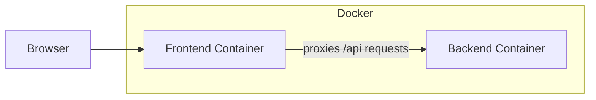

# docker-golang-react

Sample web app with a React frontend and a Go backend.

## Files

- `Dockerfile` ... production image (multi-stage; final image is `FROM scratch`)
- `docker-compose.yaml` ... development environment
- `frontend/` ... React + TypeScript + Vite + MUI
- `backend/` ... Go HTTP server (serves `/api/pods` and static assets)

## How it works

### Local development

The frontend uses [Vite](https://github.com/vitejs/vite) and the backend uses
[Air](https://github.com/cosmtrek/air) for hot reload, so neither needs manual restarts.
Serving the frontend and backend separately would cause CORS issues, so Vite's
[server.proxy](https://vitejs.dev/config/#server-proxy) forwards `/api` requests
to the backend container.



Run it:

```sh
docker compose up
# open http://localhost:3000
```

The backend (port 8080) is only reachable inside the compose network.

### Production

In production, the Go binary serves the Vite-built assets itself
(`docker build -t app . && docker run --rm -p 8080:8080 app`).
If meaningful load is expected, consider putting a CDN in front.

## Notes

- Pinned to Go 1.17 / Node 16, both EOL by now.
- `/api/pods` returns hard-coded fake Kubernetes pods; there is no real data source.
