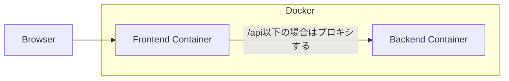

# React+GolangでWebアプリを作るサンプル

フロントエンドをReact、バックエンドをGolangで作るWebアプリのサンプル

## ファイル

- `Dockerfile` ... 本番用のDockerfile
- `docker-compose.yaml` ... 開発で利用するdocker-compose.yaml
- `frontend` ... フロントエンド用のコードを管理
- `backend` ... バックエンド用のコードを管理

## 仕組み

### ローカルでの開発

フロントエンドのビルドツールに[Vite](https://github.com/vitejs/vite)、GolangのWebアプリのホットリロードに[Air](https://github.com/cosmtrek/air)を使って、
再起動せずとも開発できるようにしている。
フロントエンド、バックエンドを分けるとCORS問題が発生するため、Viteの[server.proxy}(https://vitejs.dev/config/#server-proxy)経由で、バックエンドにリクエストを投げるようにしている。

### 本番

本番では、GolangのアプリがViteでビルドしたアセットファイルなども返すようにしている。
ある程度負荷が見込める環境であれば、CDNを挟むなどを工夫をした方が良い。
