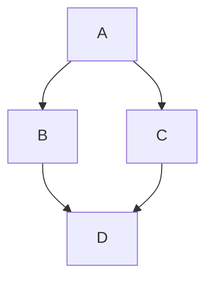
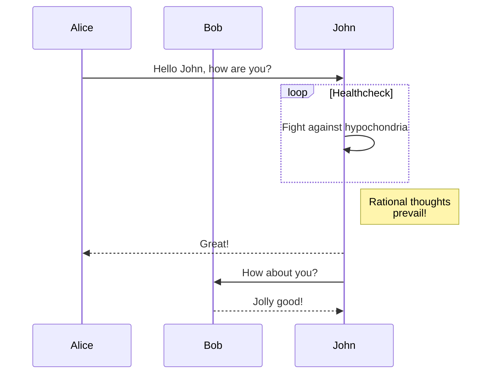
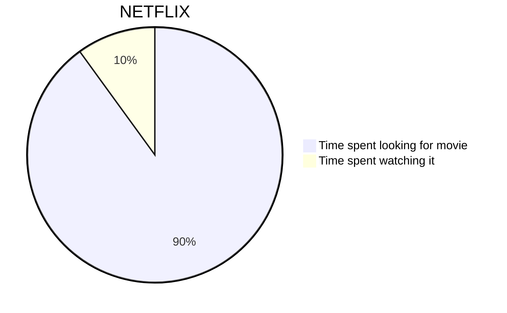
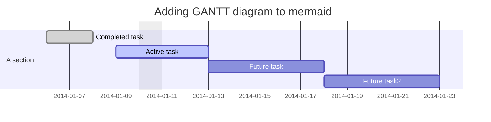
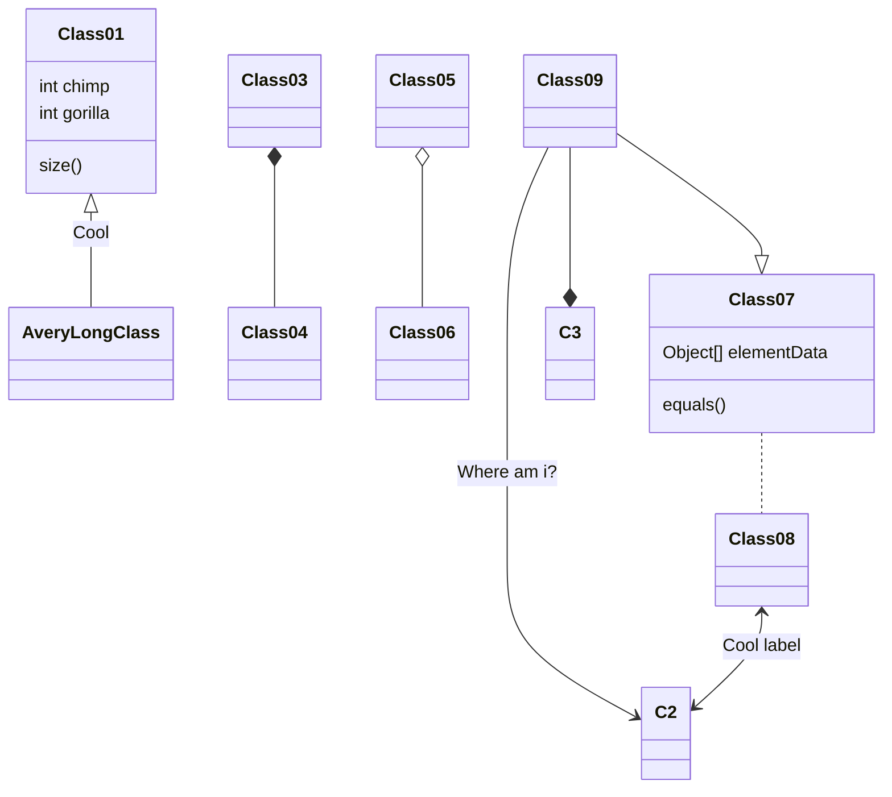
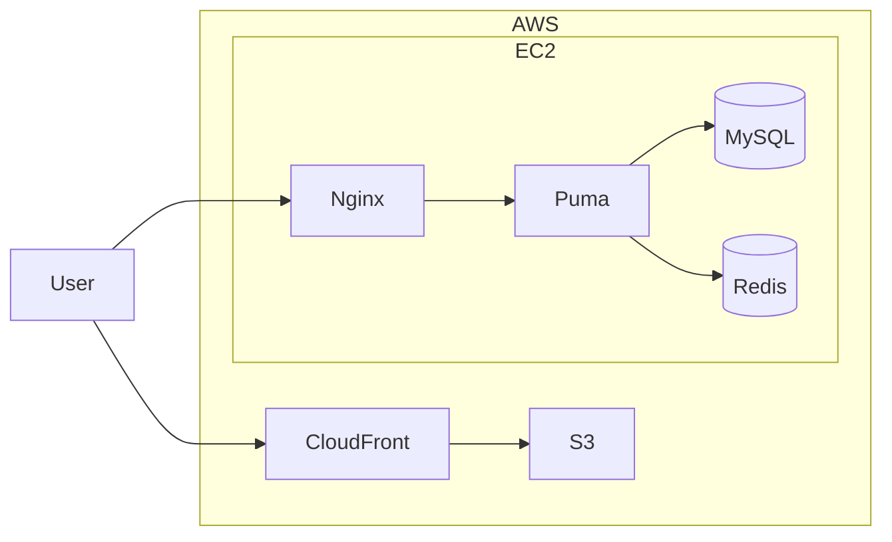

# mermaid-diagrams

Trying out [Mermaid](https://mermaid.js.org/) diagram syntax. The samples below
render natively on GitHub; `index.html` is a standalone page that renders the
basic flowchart via the Mermaid CDN build.

## Flowchart

## Sequence diagram

## Pie chart

## Gantt chart

## Class diagram

## GitGraph

## Architecture-style diagram

## Notes

- `index.html` pins Mermaid 8.14.0 from the CDN.
- The GitGraph sample uses the old `gitGraph:` + `options { ... } end` syntax,
  which newer Mermaid versions no longer accept.
