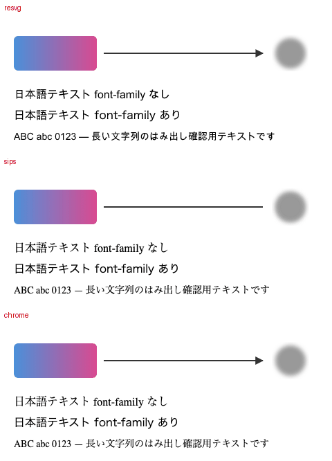
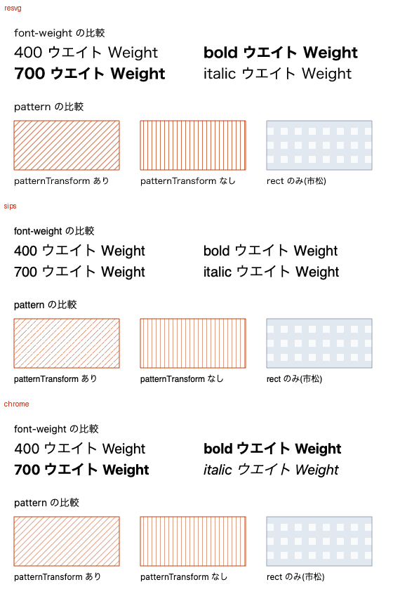
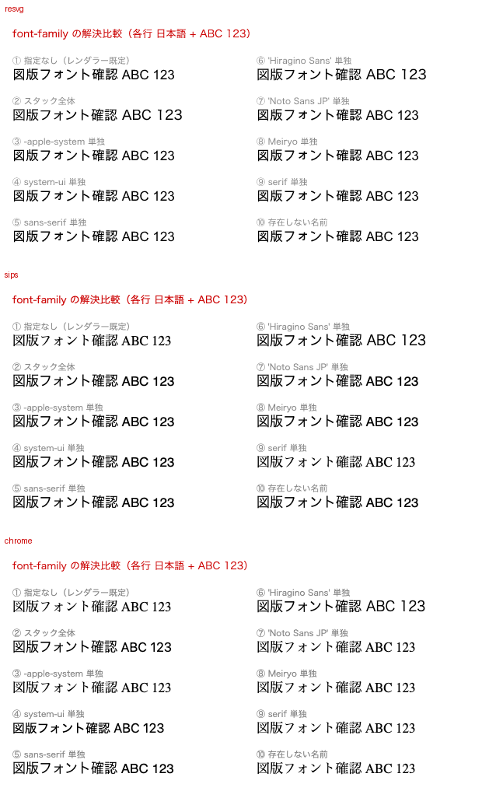

# svg-rasterizer-bench

Comparing three ways to rasterize an SVG from the command line — **resvg**,
macOS **sips**, and **headless Chrome** — for the specific job of letting an
agent look at the figure it just wrote.

The workflow behind this: an LLM writes an SVG diagram, a CLI converts it to
PNG, and the agent reads that PNG back to check whether the figure actually
came out right. `sips` is the obvious choice on macOS because it ships with
the OS, but it silently drops things. This measures what each renderer keeps,
how fast it is, and how close it lands to what a browser would show.

## Setup

```sh
nix develop     # provides resvg and python3 + Pillow
```

`sips` is macOS-only and always present there. Chrome is found at the default
macOS install path, or set `CHROME_BIN` to point elsewhere. Any renderer that
is missing is skipped rather than failing the run.

## Usage

```sh
./render.sh                 # rasterize figures/ with every available renderer -> out/
python3 compare.py          # output sizes, pairwise pixel diffs, stacked comparison images
python3 compare.py --docs   # ...and refresh the committed docs/ images
./bench.sh [n]              # per-image wall-clock time (default 5 iterations)
```

`out/` is gitignored. `compare.py` writes `out/stack-<name>.png` with the
renderers stacked vertically, which is the artifact worth actually looking at;
`--docs` also drops a quantized copy into `docs/` for the README.

## Figures

Three probes, each isolating one axis. They are deliberately small and ugly —
they exist to expose renderer behavior, not to look good.

Each image below is resvg / sips / Chrome stacked top to bottom, regenerated
with `python3 compare.py --docs`.

### `01-marker-gradient-filter.svg`

A `<marker>` arrowhead referenced via `marker-end`, a `linearGradient`, an
`feGaussianBlur`, and Japanese text both with and without an explicit
`font-family`. The root `<svg>` intentionally omits `font-family` so each
renderer's default font shows.



Only sips loses the arrowhead, and it does so without a warning.

### `02-font-weight-pattern.svg`

`font-weight` 400 / 700 / `bold`, `font-style: italic`, and three `<pattern>`
fills (with `patternTransform`, without, and rect-only).



The sips rows are all the same weight. Chrome is the only one that slants
italic. All three handle `<pattern>` and `patternTransform` correctly.

### `03-font-family-resolution.svg`

Ten `font-family` declarations (unspecified, a full stack, `-apple-system`,
`system-ui`, `sans-serif`, `Hiragino Sans`, `Noto Sans JP`, `Meiryo`,
`serif`, a nonexistent name).



resvg renders all ten rows in the same face, so a missing `font-family` never
looks wrong there — see [Caveats](#caveats).

## What it found

Measured on macOS 26.6 / Apple Silicon, Chrome 151, resvg 0.48.0. Full
numbers in [RESULTS.md](RESULTS.md).

| | `<marker>` | `font-weight` | viewBox-sized output | per image |
|---|---|---|---|---|
| resvg | yes | yes | automatic | **23 ms** |
| sips | **dropped** | **ignored** | automatic | 51 ms |
| headless Chrome | yes | yes | needs `--window-size` | 1576 ms |

Three things were worth the exercise.

**`sips` ignores `font-weight` entirely.** `400`, `700` and `bold` all render
at the same weight, with no warning. This is easy to miss because nothing
looks broken — the emphasis is just quietly gone. It is also unfixable from
the SVG side, unlike the missing `<marker>`, which you can work around by
drawing arrowheads as `<polygon>`.

**Chrome's 1.5 s is entirely process startup.** Rendering `about:blank` costs
the same as rendering the SVG, so there is nothing to optimize in the
rendering path, and a dozen "make Chrome boot faster" flags changed nothing.
Reducing it requires keeping one browser alive across images, which means
CDP, which means Puppeteer or Playwright. See RESULTS.md for the flag table
and for a `--user-data-dir` trap that hangs for minutes.

**Pixel diff ratios are a weak signal here.** Every renderer rasterizes text
differently (resvg has its own engine, sips uses CoreGraphics, Chrome uses
Skia), and that noise dominates the number — enough to bury a missing
arrowhead. Judge these renderers on whether features survive at all, not on
a diff percentage.

As a side note, resvg 0.48.0 replaced both its text shaping and font parsing
libraries, and still produces byte-identical output to 0.47.0 on all three
probes — while running about 15% faster. Details in RESULTS.md.

## Caveats

Font resolution depends on what is installed. On the test machine
`Hiragino Sans` was present but `Noto Sans JP` and `Meiryo` were not, so
declarations naming those fall through. Check yours with `resvg --list-fonts`.

resvg's own default font is `Times New Roman`, but Japanese text has no
glyphs there and falls back to `Arial Unicode MS`, so **a missing
`font-family` never looks wrong under resvg** — sips and Chrome drop to a
serif face and make the mistake visible. resvg does report it on stderr
instead, which `render.sh` captures to `out/<name>.resvg.stderr`:

```sh
resvg fig.svg out.png 2>&1 >/dev/null | grep -q Fallback && echo "unresolved font"
```
